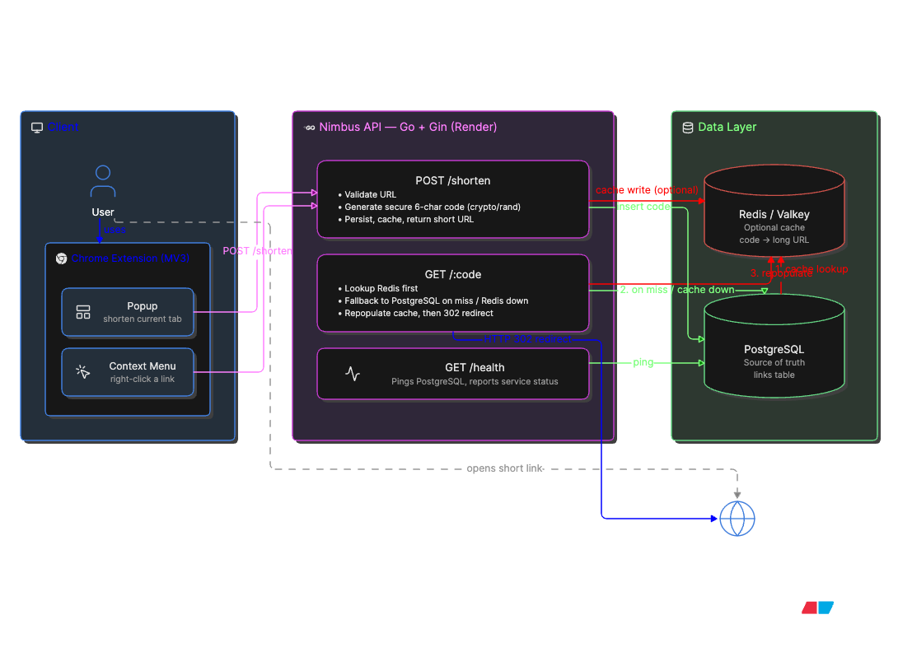

# ☁️ Nimbus
[](https://github.com/nitnawareanshuman/nimbus/actions/workflows/ci.yml)

### Fast, lightweight URL shortening directly from Chrome.

Nimbus is a full-stack URL shortener built with **Go, Gin, PostgreSQL, Redis and a Chrome Manifest V3 extension**.

Shorten the current page from the extension popup or right-click any page/link and select **Shorten with Nimbus**. Nimbus generates a compact URL, stores it persistently, and redirects visitors to the original destination.

> **No Chrome Web Store installation required.**
> Nimbus can be installed locally in Chrome in less than a minute.

---

## ✨ Features

* 🔗 Generate compact 6-character short URLs
* 🖱️ Shorten links directly from Chrome's right-click menu
* 🧩 Chrome Manifest V3 extension
* 📋 One-click copy
* 🕘 Recent-link history stored locally in Chrome
* 🐘 PostgreSQL as the persistent source of truth
* ⚡ Redis caching for faster redirects
* 🛡️ Automatic PostgreSQL fallback when Redis is unavailable
* 🔐 Cryptographically secure short-code generation
* ❤️ Production health endpoint
* 🐳 Docker support
* ☁️ Render-ready deployment
* 🌐 HTTP/HTTPS URL validation
* 🧪 Automated Go tests
* 🚦 Per-IP API rate limiting
* 🔄 GitHub Actions CI
* 🧰 Automated formatting, vet, race detection and build checks

---

# 🧩 Install the Chrome Extension

Nimbus is not currently distributed through the Chrome Web Store. You can install it locally using Chrome's built-in **Load unpacked** feature.

### 1. Download Nimbus

Clone the repository:

```bash
git clone https://github.com/nitnawareanshuman/nimbus.git
cd nimbus
```

Or download the repository as a ZIP from GitHub and extract it.

### 2. Open Chrome Extensions

Open:

```text
chrome://extensions
```

### 3. Enable Developer Mode

Turn on **Developer mode** using the switch in the top-right corner.

### 4. Load Nimbus

Click:

**Load unpacked**

Then select the:

```text
extension/
```

folder inside the downloaded Nimbus repository.

Do **not** select the entire repository. Select the `extension` directory containing `manifest.json`.

### 5. Pin Nimbus

Click Chrome's Extensions icon in the toolbar and pin **Nimbus URL Shortener**.

Nimbus is now ready to use.

---

# 🚀 Using Nimbus

### Extension popup

1. Open any normal HTTP/HTTPS webpage.
2. Click the Nimbus extension.
3. Nimbus automatically detects the current URL.
4. Click **Shorten URL**.
5. Copy the generated short link.

Nimbus also keeps recent shortened URLs locally in Chrome for quick reuse.

### Right-click shortcut

Nimbus can shorten links without opening the popup.

Right-click:

* the current webpage, or
* any link on a webpage

and select:

```text
Shorten with Nimbus
```

Nimbus creates the short URL in the background and stores it in your recent-link history.

---

# 🏗️ System Architecture



Nimbus uses PostgreSQL as the source of truth and Redis/Valkey as an optional cache.

- **POST `/shorten`** validates the URL, generates a cryptographically secure 6-character code, persists it in PostgreSQL, and caches it in Redis when available.
- **GET `/:code`** checks Redis first and falls back to PostgreSQL on a cache miss or Redis failure.
- After a PostgreSQL lookup, Nimbus repopulates the Redis cache.
- Successful lookups return an **HTTP 302 redirect** to the original URL.
- **GET `/health`** verifies PostgreSQL connectivity.


---

# 🛠️ Tech Stack

| Layer             | Technology            |
| ----------------- | --------------------- |
| Backend           | Go                    |
| HTTP framework    | Gin                   |
| Database          | PostgreSQL            |
| Cache             | Redis / Valkey        |
| Browser Extension | JavaScript, HTML, CSS |
| Extension API     | Chrome Manifest V3    |
| Containerization  | Docker                |
| Deployment        | Render                |

---

# 📡 API

## Create short URL

```http
POST /shorten
Content-Type: application/json
```

Request:

```json
{
  "url": "https://example.com"
}
```

Example response:

```json
{
  "code": "aB3xQ9",
  "short_url": "https://nimbus-api-vqsz.onrender.com/aB3xQ9",
  "target_url": "https://example.com"
}
```

## Redirect

```http
GET /:code
```

Example:

```text
GET /aB3xQ9
```

Returns an HTTP redirect to the stored destination.

## Health

```http
GET /health
```

The endpoint returns an unhealthy response if PostgreSQL cannot be reached.

---

# 💻 Run the Backend Locally

### Requirements

* Docker
* Docker Compose
* Git

Clone Nimbus:

```bash
git clone https://github.com/nitnawareanshuman/nimbus.git
cd nimbus
```

Create the environment file:

```bash
cp .env.example .env
```

Start the stack:

```bash
docker compose up --build
```

The API will be available at:

```text
http://localhost:8080
```

---

# 📁 Project Structure

```text
nimbus/
├── extension/          # Chrome Manifest V3 extension
│   ├── icons/
│   ├── background.js
│   ├── manifest.json
│   ├── popup.html
│   ├── popup.css
│   └── popup.js
│
├── handler/            # HTTP handlers
│   ├── redirect.go
│   └── shorten.go
│
├── service/            # URL/code business logic
│   └── code.go
│
├── migrations/         # PostgreSQL schema migrations
├── main.go             # API entry point
├── Dockerfile
├── docker-compose.yml
├── render.yaml
└── .env.example
```

---

# 🧪 Testing & CI/CD

Nimbus includes automated tests for important backend behavior such as
URL validation, secure short-code generation, invalid inputs, and API
rate limiting.

Run the tests locally:

```bash
go test ./...
```
---

# 🔐 Reliability

PostgreSQL is Nimbus's **source of truth**.

Redis is used only as a cache.

Therefore:

```text
Redis available
      ↓
Fast cached redirect

Redis unavailable
      ↓
PostgreSQL lookup
      ↓
Nimbus continues working
```

Short codes are generated using Go's cryptographically secure `crypto/rand` implementation rather than a predictable pseudo-random generator.

---


# 🤝 Contributing

Contributions, suggestions and bug reports are welcome.

Fork the repository, create a branch, make your changes and open a pull request.

---

# ⭐ Support

If Nimbus helped you or you found the project interesting, consider starring the repository.
